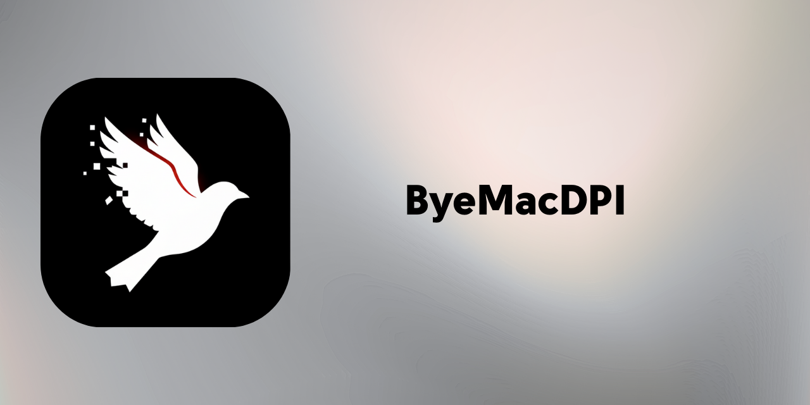

# ByeMacDPI

<div align="center">



**macOS için DPI Bypass & Şifreli DNS Aracı** | **DPI Bypass & Encrypted DNS Tool for macOS**

[](https://www.apple.com/macos/)
[](https://swift.org/)
[](LICENSE)

[English](#english) | [Türkçe](#türkçe)

</div>

---

## English

### What is ByeMacDPI v2.0?

ByeMacDPI is a native macOS application that helps bypass Deep Packet Inspection (DPI) restrictions and secure your DNS queries. It provides a beautiful, SplitWire-inspired interface to manage DPI bypass and DNS-over-HTTPS (DoH).

### Features

| Feature | Description |
|---------|-------------|
| 🚀 **Tabbed Interface** | Modern SplitWire-style tabbed navigation |
| 🛡️ **DPI Bypass** | Split, Disorder, and Fake packet techniques |
| 🌐 **DNS-over-HTTPS** | Secure DNS queries using `cloudflared` |
| ⚡ **Quick Launch** | Launch Discord and other apps through proxy |
| 🔄 **Auto-Install** | Automatically downloads latest binaries from GitHub |
| ⚙️ **Custom Profiles** | Standard, Gaming, Streaming, Privacy presets |
| 🌍 **Localization** | Support for English and Turkish |

### Screenshots

<div align="center">

| Dashboard | App Library | Settings |
|:---------:|:-----------:|:--------:|
|  |  |  |

</div>

### Installation

#### Option 1: Download Release
1. Download `ByeMacDPI.dmg` from [Releases](../../releases)
2. Open the DMG and drag to Applications
3. Launch ByeMacDPI

#### Option 2: Build from Source
```bash
git clone https://github.com/grxtor/ByeMacDPI.git
cd ByeMacDPI
./build_app.sh
open "Build/ByeMacDPI.app"
```

### Requirements
- macOS 13.0 (Ventura) or later
- Apple Silicon (M1/M2/M3) or Intel Mac

---

## Türkçe

### ByeMacDPI v2.0 Nedir?

ByeMacDPI, Deep Packet Inspection (DPI) kısıtlamalarını aşmanıza yardımcı olan ve DNS sorgularınızı güvene alan native bir macOS uygulamasıdır. DPI bypass ve DNS-over-HTTPS (DoH) yönetimi için SplitWire'dan esinlenen modern bir arayüz sunar.

### Özellikler

| Özellik | Açıklama |
|---------|----------|
| 🚀 **Tab Navigasyonu** | Modern SplitWire tarzı üst sekme navigasyonu |
| 🛡️ **DPI Bypass** | Split, Disorder ve Fake paket teknikleri |
| 🌐 **Şifreli DNS** | `cloudflared` ile DNS-over-HTTPS (DoH) desteği |
| ⚡ **Hızlı Başlatıcı** | Discord ve diğer uygulamaları proxy ile başlat |
| 🔄 **Otomatik Kurulum** | Gerekli dosyaları GitHub'dan otomatik indirir |
| ⚙️ **Özel Profiller** | Standart, Oyun, Streaming, Gizlilik profilleri |
| 🌍 **Yerelleştirme** | Türkçe ve İngilizce dil desteği |

### Kurulum

#### Seçenek 1: Release İndir
1. [Releases](../../releases) sayfasından `ByeMacDPI.dmg` indir
2. DMG'yi aç ve Applications'a sürükle
3. ByeMacDPI'ı başlat

#### Seçenek 2: Kaynak Koddan Derle
```bash
git clone https://github.com/grxtor/ByeMacDPI.git
cd ByeMacDPI
./build_app.sh
open "Build/ByeMacDPI.app"
```

---

## How It Works / Nasıl Çalışır?

```
┌─────────────────┐     ┌──────────────┐     ┌─────────────┐
│   Your App      │ ──► │  ByeMacDPI   │ ──► │  Internet   │
│ (Discord, etc.) │     │ SOCKS5 Proxy │     │  (No DPI)   │
└─────────────────┘     └──────────────┘     └─────────────┘
```

1. **ByeMacDPI** starts a local SOCKS5 proxy (default: `127.0.0.1:1080`)
2. The proxy uses DPI bypass techniques (packet splitting, TTL manipulation)
3. **Encrypted DNS** (DoH) routes DNS queries through a secure tunnel
4. Apps connect through this setup to bypass restrictions securely

---

## License / Lisans

GPL v3 License - See [LICENSE](LICENSE) for details.

---
